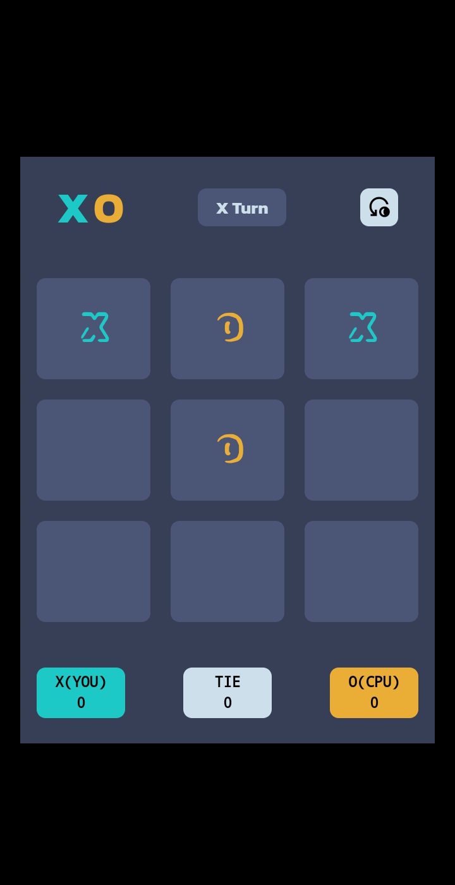

---

Tic-Tac-Toe Game

A modern and visually appealing Tic-Tac-Toe game built using HTML, CSS, and JavaScript. Play against the CPU and enjoy an interactive gaming experience.

---

🎮 Features

Dynamic Turn Indicator: Displays whose turn it is (X or O).

Scoring System: Tracks:

Wins for both X (You) and O (CPU).

Tie games.

Clean Design: User-friendly interface with smooth visuals and a dark theme.

Restart Option: Easily reset the game for another round.

---

🛠️ Technologies Used

HTML5: Structure of the game.

CSS3: Styles and animations.

JavaScript: Logic and interactivity.

---

🕹️ How to Play

1. Start the Game: The player (X) always plays first.

2. Make a Move: Tap on an empty cell to place your mark (X or O).

3. Winning Conditions:

Be the first to get three marks in a row:

Horizontally.

Vertically.

Diagonally.

4. End Game:

If all cells are filled without a winner, the game ends in a tie.

5. Restart: Use the reset button to play again.

---